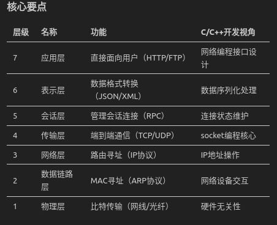
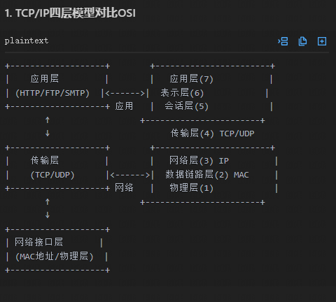

# 第一阶段：基础概念

## 1.OSI七层模型



## 2.掌握各层名称及功能（物理层→应用层）

## 3.理解数据封装过程（数据→段→包→帧→比特）

data-->segment-->packet-->frame-->bit
发送端封装：
数据->加tcp头（段）->加ip头（包）->加ethernet头（帧）->加物理头（比特）
接收端解封装：
比特->帧（剥离mac头）->包（剥离ip头）->段（剥离tcp头）->数据

quetsion：为什么需要模块化设计？
模块化设计：降低网络复杂度，高层独立演讲。

## 4.TCP/IP协议栈
对比OSI模型，理解四层结构


```
 0                   1                   2                   3
 0 1 2 3 4 5 6 7 8 9 0 1 2 3 4 5 6 7 8 9 0 1 2 3 4 5 6 7 8 9 0 1
+-+-+-+-+-+-+-+-+-+-+-+-+-+-+-+-+-+-+-+-+-+-+-+-+-+-+-+-+-+-+-+-+
|Version|  IHL  |Type of Service|          Total Length         |
+-+-+-+-+-+-+-+-+-+-+-+-+-+-+-+-+-+-+-+-+-+-+-+-+-+-+-+-+-+-+-+-+
|         Identification        |Flags|      Fragment Offset    |
+-+-+-+-+-+-+-+-+-+-+-+-+-+-+-+-+-+-+-+-+-+-+-+-+-+-+-+-+-+-+-+-+
|  Time to Live |    Protocol   |         Header Checksum       |
+-+-+-+-+-+-+-+-+-+-+-+-+-+-+-+-+-+-+-+-+-+-+-+-+-+-+-+-+-+-+-+-+
|                       Source Address                          |
+-+-+-+-+-+-+-+-+-+-+-+-+-+-+-+-+-+-+-+-+-+-+-+-+-+-+-+-+-+-+-+-+
|                    Destination Address                        |
+-+-+-+-+-+-+-+-+-+-+-+-+-+-+-+-+-+-+-+-+-+-+-+-+-+-+-+-+-+-+-+-+
|                    Options                    |    Padding    |
+-+-+-+-+-+-+-+-+-+-+-+-+-+-+-+-+-+-+-+-+-+-+-+-+-+-+-+-+-+-+-+-+
```

> 1. Version (4位): 指示IP协议的版本,IPv4为4。
>
> 2. IHL (4位): Internet Header Length,首部长度,以32位字为单位。最小值为5(20字节)。
>
> 3. Type of Service (8位): 服务类型,用于QoS(服务质量)。
>
> 4. Total Length (16位): 整个IP数据包的总长度,以字节为单位。
>
> 5. Identification (16位): 标识,用于分片重组。
>
> 6. Flags (3位): 标志位,用于控制和识别分片。
>
> 7. Fragment Offset (13位): 分片偏移量,指示分片在原始数据包中的位置。
>
> 8. Time to Live (8位): 生存时间,防止数据包在网络中无限循环。
>
> 9. Protocol (8位): 指示上层协议,如TCP(6)或UDP(17)。
>
> 10. Header Checksum (16位): 首部校验和,用于错误检测。
>
> 11. Source Address (32位): 源IP地址。
>
> 12. Destination Address (32位): 目的IP地址。
>
> 13. Options (可变长度): 可选字段,用于测试、调试或安全。
>
> 14. Padding: 填充,确保IP首部长度是32位的整数倍。
>

question:
Q1.为什么首部长度是20字节起？
A1：IPv4协议头长度为20字节，因为IPv4协议头是32位字（4字节）为单位的，所以最小长度为5个32位字，即20字节。 
固定部分占20字节，可选字段最多40字节（保证首部长度不超过60字节）。

Q2：TTL128和64的区别？
A2：windows是128，linux默认是64.


## 5.学习IP地址分类（IPv4/IPv6基础）

基础术语
MAC地址、子网掩码、网关、DNS
二进制/十六进制转换基础


第二阶段：核心协议（第4-7天）
传输层协议
TCP三次握手/四次挥手（用图示理解）
UDP特点及使用场景对比
网络层协议
IP协议头结构解析
ICMP协议（ping原理）
应用层协议
HTTP请求/响应结构
DNS查询过程演示
FTP/Telnet基础操作

第三阶段：实践操作（第8-12天）
网络工具使用
Wireshark抓包分析（过滤表达式）
tcpdump命令行抓包
ping/traceroute命令实践
模拟实验
使用Packet Tracer搭建简单网络
配置静态路由和默认路由
VLAN划分实验
常见故障排查
IP地址冲突解决方案
网络连通性测试流程
ARP表查看与解析

第四阶段：综合提升（第13-14天）
协议对比分析
TCP与UDP性能差异
IPv4与IPv6头部对比
安全基础
SSL/TLS握手过程
常见DDoS攻击原理
扩展学习
SDN/NFV概念初探
5G网络协议栈概览
学习资源建议
工具：Wireshark、Cisco Packet Tracer
书籍：《计算机网络：自顶向下方法》
实验平台：华为eNSP、GNS3
在线课程：B站「网络协议入门」系列
⚠️ 注意事项：

每天保持2-3小时有效学习时间
重点理解协议交互过程而非死记硬背
建议制作协议思维导图辅助记忆
实验环境出现错误时优先自行排查
通过两周学习可达到： ✅ 看懂基本网络协议报文 ✅ 理解常见网络通信过程 ✅ 独立完成简单网络配置 ✅ 具备继续深入学习的基础能力